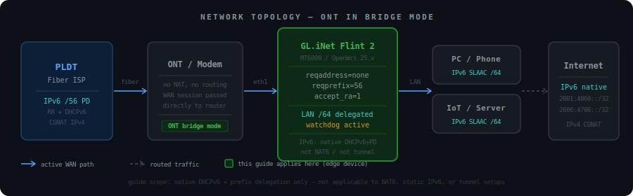
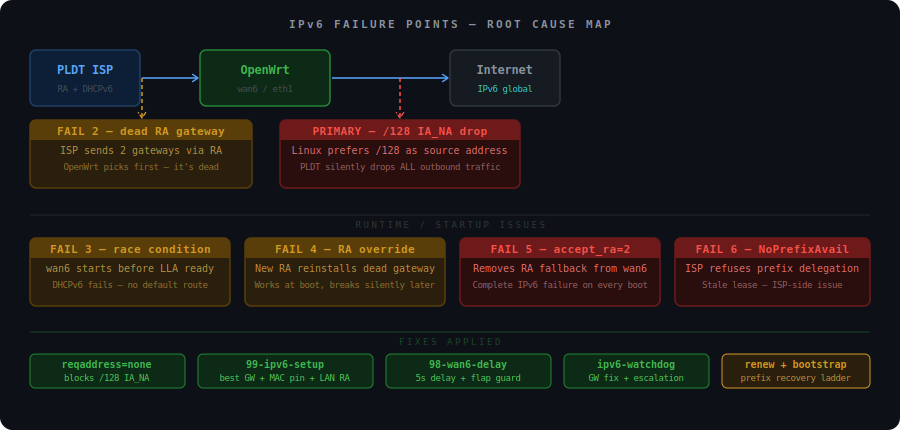
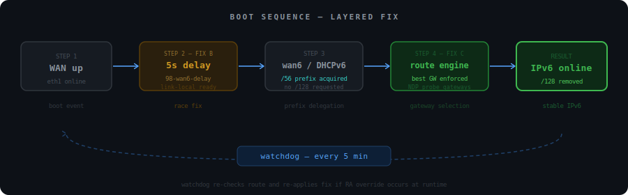

# IPv6 Fix Guide: GL.iNet GL-MT6000 (Flint 2) on PLDT Fiber (Bridge Mode)

[](#)
[](#)
[](#)

**Device:** GL.iNet GL-MT6000 (Flint 2) | **Firmware:** OpenWrt 25.12.2 (vanilla OpenWrt) | **ISP:** PLDT Fiber (Bridge mode) | **WAN:** `eth1` | **Mode:** DHCPv6 + Prefix Delegation

A production-grade, self-healing IPv6 setup for PLDT Fiber subscribers running OpenWrt in bridge mode.
Includes root-cause analysis, startup fixes, runtime recovery, escalating failure handling, and real-world edge cases observed in production use.

---

## TL;DR

If you are on PLDT Fiber in bridge mode and IPv6 is broken:

1. Apply UCI config
2. Add hotplug scripts
3. Add watchdog
4. Reboot
5. Verify with `ping6 2001:4860:4860::8888`

Full instructions below.

---

## Read Before Applying

> **This is not a generic IPv6 guide.** It targets a specific failure pattern observed on PLDT Fiber in bridge mode. Applying it to a different setup may break working IPv6.

Use this guide only if:

- You are on PLDT Fiber (or an ISP with similar IA_NA + RA behavior)
- Your ONT is in bridge mode and OpenWrt is the first-hop edge router
- You observe broken `/128` WAN address behavior, incorrect RA gateway selection, or intermittent IPv6 loss after boot

**Assumptions:**

- WAN interface is `eth1` (verify with `ip link` before applying)
- Default `fw4` firewall configuration, no custom ICMPv6 rules
- DHCPv6 with prefix delegation, not PPPoE
- Single-router setup, no cascaded routers or double NAT

**This guide is not designed for:**

- PPPoE WAN
- VLAN-tagged WAN interfaces
- Double NAT setups where OpenWrt is not the edge device
- Non-standard interface naming

All timing values (`sleep`, retry intervals, cooldown durations) are field-tuned for PLDT behavior. Other ISPs may require adjustments.

---

## Post-Deploy Verification

Run these checks after reboot to confirm the fix is working correctly.

**1. No global /128 on WAN**

```sh
ip -6 addr show dev eth1
```

Good: no `scope global` address with `/128`

**2. Prefix assigned**

```sh
ubus call network.interface.wan6 status | jsonfilter -e '@["ipv6-prefix"][0].address'
```

Good: returns a global prefix

**3. Default route correct**

```sh
ip -6 route show default
```

Good: single route via `fe80::...` on `eth1`

**4. Gateway reachable**

```sh
ip -6 neigh show dev eth1 | grep router
```

Good: state is `REACHABLE` or `STALE`, not `INCOMPLETE`

**5. Connectivity works**

```sh
ping6 -c 4 2001:4860:4860::8888
ping6 -c 4 2606:4700:4700::1111
```

**6. LAN clients have IPv6**

Clients should receive global IPv6 addresses, not just `fe80::` link-local addresses.

**7. Logs are clean**

```sh
logread | grep ipv6-setup
logread | grep ipv6-watchdog
```

---

## Table of Contents

- [TL;DR](#tldr)
- [Read Before Applying](#read-before-applying)
- [Post-Deploy Verification](#post-deploy-verification)
- [Quick Deploy](#quick-deploy)
- [Compatibility](#compatibility)
- [Caution: Bridge Mode and Third-Party Router Setups](#caution-bridge-mode-and-third-party-router-setups)
- [Root Causes](#root-causes)
- [Fix Architecture](#fix-architecture)
- [Step 1 - UCI Config](#step-1---uci-config)
- [Step 2 - wan6 Startup Delay](#step-2---wan6-startup-delay)
- [Step 3 - IPv6 Route Fix Engine](#step-3---ipv6-route-fix-engine)
- [Step 4 - IPv6 Watchdog](#step-4---ipv6-watchdog)
- [Step 5 - Cron Setup](#step-5---cron-setup)
- [Optional: Discord Notifications](#optional-discord-notifications)
- [Troubleshooting and Debug Commands](#troubleshooting-and-debug-commands)
- [Validated Behavior](#validated-behavior)
- [Final Result](#final-result)
- [Preserving Scripts Across Firmware Upgrades](#preserving-scripts-across-firmware-upgrades)
- [Known Edge Cases](#known-edge-cases)
- [Advanced Notes: DUID and ULA](#advanced-notes-duid-and-ula)
- [Disclaimer](#disclaimer)

---

## Quick Deploy

Apply in this order, then reboot:

1. Apply UCI config
2. Create `/etc/hotplug.d/iface/98-wan6-delay`
3. Create `/etc/hotplug.d/iface/99-ipv6-setup`
4. Create `/usr/bin/ipv6-watchdog`
5. Add cron job and restart cron
6. Reboot

Optional: set up Discord notifications (see [Optional: Discord Notifications](#optional-discord-notifications)).

Test after reboot:

```sh
ping6 2001:4860:4860::8888
```

Check logs:

```sh
logread | grep ipv6-setup
logread | grep ipv6-watchdog
```

---

## Compatibility

Tested on:
- PLDT Fiber in bridge mode
- OpenWrt 25.12.2 (vanilla OpenWrt, not GL.iNet stock firmware)
- GL.iNet GL-MT6000 (Flint 2)



May work on:
- Other ISPs with similar IA_NA + RA gateway issues (common with CGNAT providers)

Not designed for:
- Double NAT setups where OpenWrt is not the first hop
- Non-OpenWrt firmware

Expected to work on:
- OpenWrt 24.x and newer (fw4-based builds)

This was tested on OpenWrt 25.12.2 only. Older builds, custom images, and non-default environments may behave differently.

Core components used by the scripts:

- `odhcp6c` - DHCPv6 client (critical for prefix delegation)
- `netifd` - network interface management and hotplug system
- `busybox` - shell environment (`awk`, `grep`, `seq`, etc.)
- `ip` - IPv6 routing and neighbor commands
- `ubus` and `jsonfilter` - interface status and prefix detection
- `ping6` - connectivity checks
- `curl` - required only if Discord notifications are enabled (`apk add curl`)

These are included in standard OpenWrt builds but may be missing in minimal or custom images. Tested on the default OpenWrt image with no additional packages required for the core setup.

Troubleshooting commands assume standard OpenWrt CLI tools are available.

---

## Caution: Bridge Mode and Third-Party Router Setups

This guide assumes your ONT/modem is in **bridge mode**, passing the session directly to your OpenWrt router as the edge device.

If you have a **third-party router behind the main OpenWrt router** (double NAT), be aware:

- IPv6 prefix delegation (`IA_PD`) may not pass cleanly downstream
- The hotplug scripts must run on whichever device holds the actual WAN interface
- If your ISP assigns a `/128` via `IA_NA` and your router is not the edge device, the `/128` fix still applies on that edge device
- PLDT ONT firmware quirks can cause link-local addresses to flap, making the race condition in Step 2 more likely to trigger

---

## Root Causes

### Primary root cause

**Broken /128 WAN address (IA_NA)**

The ISP assigns a `/128` WAN address via IA_NA alongside the delegated `/56` prefix. OpenWrt prefers the `/128` as the source address for all outbound traffic. PLDT silently drops every packet originating from it. Removing the `/128` immediately restores connectivity.

This is the dominant failure. Everything else amplifies or destabilizes it.



### Secondary issues

**2. Multiple RA gateways, wrong one selected** - The ISP advertises two gateways via Router Advertisement. OpenWrt selects the first, which is dead. Neighbor table shows `INCOMPLETE` state.

**3. wan6 startup race condition** - `wan6` starts before the link-local address is ready on `eth1`, causing DHCPv6 to fail inconsistently after reboots.

**4. RA runtime override** - Even after fixing the route at boot, the dead gateway returns via a later RA and silently breaks connectivity again.

**5. Incorrect RA tuning** - Using `accept_ra='2'` with `defaultroute='0'` removes the fallback behavior `wan6` needs during initialization, causing complete IPv6 failure on every boot.

> **Warning:** Do not use `accept_ra='2'` with `defaultroute='0'`. This breaks `wan6` initialization and removes fallback routing, causing complete IPv6 failure on boot.

---

## Fix Architecture

**Startup flow:**

```
WAN up -> delay (5s) -> wan6 starts -> prefix acquired -> route fix engine runs
```

**Runtime flow:**

```
Watchdog (every 5 min) -> check connectivity -> fix route -> escalate if needed -> notify if unrecoverable
```

**Layers:**

| Layer | File | Purpose |
|---|---|---|
| A - UCI config | `network` UCI | Disables `/128`, stabilizes RA, delegates prefix |
| B - Delay script | `98-wan6-delay` | Fixes link-local race condition at boot |
| C - Route engine | `99-ipv6-setup` | Selects working gateway at startup |
| D - Watchdog | `ipv6-watchdog` | Self-heals runtime failures every 5 min |
| E - Bootstrap recovery | `ipv6-watchdog` | Recovers DHCPv6 prefix failures automatically |
| F - Notifications | `ipv6-discord-logger` | Optional Discord alerts and log forwarding |



---

## Step 1 - UCI Config

Apply this first. Everything else depends on it.

```sh
uci set network.wan6.reqaddress='none'
uci set network.wan6.reqprefix='56'
uci delete network.wan6.norelease
uci delete network.wan6.ip6assign
uci set network.wan6.device='eth1'
uci set network.wan6.accept_ra='1'

uci set network.lan.ip6assign='64'
uci set network.lan.ip6class='wan6'

uci commit network
```

What each setting does:

| Setting | Value | Why |
|---|---|---|
| `reqaddress` | `none` | Prevents ISP from assigning a broken `/128` WAN address |
| `reqprefix` | `56` | Explicitly requests the delegated `/56` block |
| `accept_ra` | `1` | Keeps RA processing on so `wan6` initializes correctly |
| `ip6assign` | `64` | LAN gets a `/64` from the delegated prefix |
| `ip6class` | `wan6` | Binds LAN prefix delegation to the `wan6` interface |

---

## Step 2 - wan6 Startup Delay

**File:** `/etc/hotplug.d/iface/98-wan6-delay`

Waits for WAN to be fully ready before starting `wan6`, eliminating the link-local race condition.

```sh
#!/bin/sh
[ "$ACTION" = "ifup" ] || exit 0
[ "$INTERFACE" = "wan" ] || exit 0

# Skip if wan6 is already up to avoid duplicate ifup on WAN flap.
ubus call network.interface.wan6 status 2>/dev/null \
    | jsonfilter -e '@["up"]' | grep -q true && exit 0

sleep 5
ifup wan6
```

```sh
chmod +x /etc/hotplug.d/iface/98-wan6-delay
```

---

## Step 3 - IPv6 Route Fix Engine

**File:** `/etc/hotplug.d/iface/99-ipv6-setup`

Runs whenever `wan6` comes up. Detects the working gateway via NDP, enforces the correct default route, and removes any stale `/128` addresses after confirming connectivity.

```sh
#!/bin/sh
[ "$ACTION" = "ifup" ] || exit 0
[ "$INTERFACE" = "wan6" ] || exit 0

LOGTAG="ipv6-setup"
log() { logger -t "$LOGTAG" "$1"; }

WAN_DEV=$(ubus call network.interface.wan6 status 2>/dev/null \
    | jsonfilter -e '@["l3_device"]')

[ -z "$WAN_DEV" ] && { log "ERROR: no WAN device"; exit 1; }

# Wait for link-local
for i in $(seq 1 10); do
    lla=$(ip -6 addr show dev "$WAN_DEV" | awk '/fe80.*scope link/{print $2}')
    [ -n "$lla" ] && break
    sleep 2
done

# Wait for prefix
PREFIX=""
for i in $(seq 1 15); do
    PREFIX=$(ubus call network.interface.wan6 status 2>/dev/null \
        | jsonfilter -e '@["ipv6-prefix"][0].address')
    [ -n "$PREFIX" ] && break
    sleep 3
done

if [ -z "$PREFIX" ]; then
    log "No prefix after 45s, watchdog will handle recovery"
    exit 0
fi

# Trigger NDP discovery
ping6 -c 3 -W 1 -I "$WAN_DEV" ff02::2 >/dev/null 2>&1
sleep 3

BEST_GW=""

for gw in $(ip -6 neigh show dev "$WAN_DEV" | awk '/router/{print $1}' | sort -u); do
    ping6 -c 2 -W 2 -I "$WAN_DEV" "$gw" >/dev/null 2>&1 || continue
    BEST_GW="$gw"
    break
done

[ -z "$BEST_GW" ] && {
    log "No gateway found, restarting WAN"
    ifdown wan6; ifdown wan
    sleep 20
    ifup wan; sleep 40; ifup wan6
    exit 0
}

# Replace dead routes with working one
ip -6 route show default dev "$WAN_DEV" | awk '{print $3}' \
| while read -r old; do
    [ "$old" = "$BEST_GW" ] || ip -6 route del default via "$old" dev "$WAN_DEV"
done

ip -6 route replace default via "$BEST_GW" dev "$WAN_DEV" metric 512

# Verify connectivity and remove /128 if successful
sleep 3
if ping6 -c 2 2001:4860:4860::8888 >/dev/null 2>&1; then
    ip -6 addr show dev "$WAN_DEV" | awk '/\/128 scope global/{print $2}' \
    | while read -r addr; do
        ip -6 addr del "$addr" dev "$WAN_DEV"
        log "Removed /128: $addr"
    done
else
    log "Connectivity check failed, /128 kept pending watchdog"
fi
```

```sh
chmod +x /etc/hotplug.d/iface/99-ipv6-setup
```

---

## Step 4 - IPv6 Watchdog

**File:** `/usr/bin/ipv6-watchdog`

Runs every 5 minutes via cron. Checks connectivity against Google and Cloudflare IPv6 resolvers. On failure, separates two distinct failure domains and handles each with an escalating recovery ladder.

**Failure domains:**

| Condition | Recovery path |
|---|---|
| Dead RA gateway (prefix present, connectivity broken) | Gateway fix, then WAN restart after 3 consecutive failures |
| Missing prefix (DHCPv6 failure) | Escalating ladder: wan6 restart, /128 bootstrap, full WAN restart |
| Persistent prefix failure after 3 WAN restarts | Stop retrying, notify once, wait for manual ONT powercycle |

**Escalation timeline for persistent NoPrefixAvail:**

```
Tick 1  (0 min)   No prefix. Restart wan6. Backoff 10 min.
Tick 3  (10 min)  Still no prefix. /128 bootstrap. Backoff 20 min.
Tick 7  (30 min)  Still no prefix. Full WAN restart. Cooldown 20 min.
Tick 11 (50 min)  Out of cooldown. Ladder resets. Tries again.
...
After 3 full WAN restarts with no recovery: stop, notify once via log and Discord (if configured).
```

**Why backoff matters:** Rapid reconnects worsen stale lease conditions on PLDT's DHCPv6 server (see Edge Case 6). The spacing gives the ISP time between attempts.

```sh
#!/bin/sh
# /usr/bin/ipv6-watchdog
# IPv6 watchdog with escalating recovery, backoff, cooldown, and ONT notification.
# Runs every 5 minutes via cron.

LOGTAG="ipv6-watchdog"
STATE_DIR="/tmp/ipv6-watchdog"
CONF="/etc/ipv6-watchdog.conf"
mkdir -p "$STATE_DIR"

log() { logger -t "$LOGTAG" "$1"; }

# Prevent overlapping executions. If a previous run is still active
# (e.g. during bootstrap or WAN restart), exit immediately.
LOCK="$STATE_DIR/watchdog.lock"
exec 9>"$LOCK"
flock -n 9 || { log "Already running, skipping this tick"; exit 0; }

[ -f "$CONF" ] && . "$CONF"

# How long to wait after a full WAN restart before trying again (20 minutes).
# Aligned with PLDT stale lease behavior documented in Edge Case 6.
WAN_RESTART_COOLDOWN=1200

# How many full WAN restarts before stopping and requiring manual ONT powercycle.
WAN_RESTART_LIMIT=3

# State files
FAIL_FILE="$STATE_DIR/fail_count"
PREFIX_FAIL_FILE="$STATE_DIR/prefix_fail_count"
WAN_RESTART_FILE="$STATE_DIR/wan_restart_count"
LAST_WAN_RESTART_FILE="$STATE_DIR/last_wan_restart"
PREFIX_BACKOFF_FILE="$STATE_DIR/prefix_next_attempt"
ONT_FLAG="$STATE_DIR/ont_notified"

FAILS=$(cat "$FAIL_FILE" 2>/dev/null || echo 0)
PREFIX_FAILS=$(cat "$PREFIX_FAIL_FILE" 2>/dev/null || echo 0)
WAN_RESTARTS=$(cat "$WAN_RESTART_FILE" 2>/dev/null || echo 0)
LAST_RESTART=$(cat "$LAST_WAN_RESTART_FILE" 2>/dev/null || echo 0)
PREFIX_NEXT=$(cat "$PREFIX_BACKOFF_FILE" 2>/dev/null || echo 0)
NOW=$(date +%s)

# Add jitter to avoid synchronized retry bursts across rapid cron ticks.
sleep $((RANDOM % 5 + 5))

WAN_DEV=$(ubus call network.interface.wan6 status 2>/dev/null \
    | jsonfilter -e '@["l3_device"]')
[ -z "$WAN_DEV" ] && { log "ERROR: WAN_DEV not found, wan6 may be down"; exit 1; }

ipv6_ok() {
    ping6 -c 2 -W 3 2001:4860:4860::8888 >/dev/null 2>&1 && return 0
    ping6 -c 2 -W 3 2606:4700:4700::1111 >/dev/null 2>&1 && return 0
    return 1
}

has_prefix() {
    ubus call network.interface.wan6 status 2>/dev/null \
        | jsonfilter -e '@["ipv6-prefix"][0].address' | grep -q .
}

fix_gateway() {
    current=$(ip -6 route show default dev "$WAN_DEV" | awk 'NR==1{print $3}')
    ping6 -c 2 -W 2 -I "$WAN_DEV" "$current" >/dev/null 2>&1 && return 1

    for gw in $(ip -6 neigh show dev "$WAN_DEV" | awk '/router/{print $1}'); do
        ping6 -c 2 -W 2 -I "$WAN_DEV" "$gw" >/dev/null 2>&1 || continue
        ip -6 route replace default via "$gw" dev "$WAN_DEV" metric 512
        log "Gateway replaced with $gw"
        return 0
    done
    return 1
}

in_cooldown() {
    ELAPSED=$((NOW - LAST_RESTART))
    [ "$LAST_RESTART" -gt 0 ] && [ "$ELAPSED" -lt "$WAN_RESTART_COOLDOWN" ]
}

do_wan_restart() {
    WAN_RESTARTS=$((WAN_RESTARTS + 1))
    echo "$WAN_RESTARTS" > "$WAN_RESTART_FILE"
    echo "$NOW" > "$LAST_WAN_RESTART_FILE"
    echo 0 > "$PREFIX_FAIL_FILE"
    echo 0 > "$FAIL_FILE"

    log "Full WAN restart #$WAN_RESTARTS of $WAN_RESTART_LIMIT"
    ifdown wan6; ifdown wan
    sleep 30
    ifup wan; sleep 20; ifup wan6
}

notify_ont_powercycle() {
    local restarts="$1"
    local timestamp
    timestamp=$(date '+%Y-%m-%d %H:%M:%S')

    log "ACTION REQUIRED: IPv6 prefix not recovered after $restarts WAN restarts."
    log "ACTION REQUIRED: Power off ONT, wait 15-30 minutes, then power on."
    log "ACTION REQUIRED: Likely cause: stale DHCPv6 lease (NoPrefixAvail) on PLDT side."

    [ -z "$DISCORD_WEBHOOK" ] && return 0

    local payload
    payload=$(cat <<EOF
{
  "embeds": [{
    "title": "IPv6 Alert: ONT Power Cycle Required",
    "color": 15158332,
    "fields": [
      { "name": "Router", "value": "GL-MT6000 (Flint 2)", "inline": true },
      { "name": "WAN restarts", "value": "$restarts", "inline": true },
      { "name": "Time", "value": "$timestamp", "inline": false },
      { "name": "Likely cause", "value": "NoPrefixAvail: stale DHCPv6 lease on ISP side", "inline": false },
      { "name": "Action required", "value": "Power off ONT. Wait 15-30 minutes. Power on.", "inline": false }
    ],
    "footer": { "text": "ipv6-watchdog on OpenWrt 25.12.2" }
  }]
}
EOF
)

    curl -s \
        -H "Content-Type: application/json" \
        -X POST \
        -d "$payload" \
        "$DISCORD_WEBHOOK" >/dev/null 2>&1 \
    && log "Discord alert sent" \
    || log "Discord alert failed (curl error)"
}

try_128_bootstrap() {
    log "Attempting /128 bootstrap to recover prefix delegation"

    # Stage 'try' without committing so it never persists across reboots.
    uci set network.wan6.reqaddress='try'
    ubus call network reload >/dev/null 2>&1
    ifdown wan6; sleep 5; ifup wan6

    sleep 30

    # Restore and re-cycle so netifd picks up the restored setting.
    uci set network.wan6.reqaddress='none'
    ubus call network reload >/dev/null 2>&1
    ifdown wan6; sleep 5; ifup wan6

    local i prefix
    for i in $(seq 1 10); do
        prefix=$(ubus call network.interface.wan6 status 2>/dev/null \
            | jsonfilter -e '@["ipv6-prefix"][0].address')
        [ -n "$prefix" ] && break
        sleep 3
    done

    if [ -n "$prefix" ]; then
        log "Prefix acquired via bootstrap: $prefix, verifying connectivity"
        if ping6 -c 2 -W 3 2001:4860:4860::8888 >/dev/null 2>&1; then
            ip -6 addr show dev "$WAN_DEV" | awk '/\/128 scope global/{print $2}' \
            | while read -r addr; do
                ip -6 addr del "$addr" dev "$WAN_DEV"
                log "Removed /128: $addr"
            done
            return 0
        else
            log "Prefix present but connectivity failed, keeping /128 for next cycle"
            return 1
        fi
    else
        log "Bootstrap failed, no prefix acquired after restore"
        return 1
    fi
}

# Happy path: reset all state.
if ipv6_ok; then
    if [ -f "$ONT_FLAG" ] && [ -n "$DISCORD_WEBHOOK" ]; then
        RECOVERY_PAYLOAD='{"embeds":[{"title":"IPv6 Recovered","color":3066993,"description":"IPv6 connectivity restored. All counters reset.","footer":{"text":"ipv6-watchdog"}}]}'
        curl -s -H "Content-Type: application/json" -X POST \
            -d "$RECOVERY_PAYLOAD" "$DISCORD_WEBHOOK" >/dev/null 2>&1
        log "IPv6 recovered after critical failure, Discord recovery notice sent"
    fi

    echo 0 > "$FAIL_FILE"
    echo 0 > "$PREFIX_FAIL_FILE"
    echo 0 > "$WAN_RESTART_FILE"
    echo 0 > "$LAST_WAN_RESTART_FILE"
    rm -f "$ONT_FLAG"
    rm -f "$PREFIX_BACKOFF_FILE"
    exit 0
fi

# No prefix: escalating recovery path.
if ! has_prefix; then

    if [ "$WAN_RESTARTS" -ge "$WAN_RESTART_LIMIT" ]; then
        if [ ! -f "$ONT_FLAG" ]; then
            notify_ont_powercycle "$WAN_RESTARTS"
            touch "$ONT_FLAG"
        else
            log "Awaiting manual ONT powercycle (restart limit reached), no action taken"
        fi
        exit 0
    fi

    if in_cooldown; then
        ELAPSED=$((NOW - LAST_RESTART))
        REMAINING=$((WAN_RESTART_COOLDOWN - ELAPSED))
        log "In post-restart cooldown, ${REMAINING}s remaining, skipping"
        exit 0
    fi

    if [ "$NOW" -lt "$PREFIX_NEXT" ]; then
        REMAINING=$((PREFIX_NEXT - NOW))
        log "Prefix backoff active, ${REMAINING}s remaining, skipping"
        exit 0
    fi

    PREFIX_FAILS=$((PREFIX_FAILS + 1))
    echo "$PREFIX_FAILS" > "$PREFIX_FAIL_FILE"

    # Exponential backoff capped at 30 minutes:
    # fail 1 = 10 min, fail 2 = 20 min, fail 3+ = 30 min cap.
    BACKOFF_SECS=$(( 600 * (1 << (PREFIX_FAILS - 1)) ))
    [ "$BACKOFF_SECS" -gt 1800 ] && BACKOFF_SECS=1800
    echo $((NOW + BACKOFF_SECS)) > "$PREFIX_BACKOFF_FILE"

    if [ "$PREFIX_FAILS" -eq 1 ]; then
        log "No prefix (attempt $PREFIX_FAILS), restarting wan6, backoff ${BACKOFF_SECS}s"
        ifdown wan6; sleep 10; ifup wan6

    elif [ "$PREFIX_FAILS" -eq 2 ]; then
        log "No prefix (attempt $PREFIX_FAILS), trying /128 bootstrap, backoff ${BACKOFF_SECS}s"
        try_128_bootstrap

    else
        log "No prefix (attempt $PREFIX_FAILS), escalating to full WAN restart"
        do_wan_restart
    fi

    exit 0
fi

# Has prefix but connectivity is broken: try gateway fix first.
if fix_gateway; then
    sleep 5
    if ipv6_ok; then
        echo 0 > "$FAIL_FILE"
        echo 0 > "$PREFIX_FAIL_FILE"
        exit 0
    fi
fi

FAILS=$((FAILS + 1))
echo "$FAILS" > "$FAIL_FILE"
log "Connectivity failure $FAILS (prefix present, gateway broken or route dead)"

if [ "$FAILS" -ge 3 ]; then
    log "3 consecutive connectivity failures, escalating to full WAN restart"
    do_wan_restart
fi
```

```sh
chmod +x /usr/bin/ipv6-watchdog
```

---

## Step 5 - Cron Setup

**File:** `/etc/crontabs/root`

Add the watchdog (idempotent, safe to run multiple times):

```sh
grep -qxF '*/5 * * * * /usr/bin/ipv6-watchdog' /etc/crontabs/root || \
echo '*/5 * * * * /usr/bin/ipv6-watchdog' >> /etc/crontabs/root

/etc/init.d/cron restart
```

---

## Optional: Discord Notifications

This section is entirely optional. The core IPv6 fix works without it. If you skip this section, the watchdog still self-heals and logs everything locally via `logread`.

If you want real-time visibility on your phone or desktop, you can wire up two Discord webhook channels.

**What you get:**

| Channel | What it receives |
|---|---|
| `#ipv6-alerts` | ONT powercycle alert (red embed, once per incident) and recovery notice (green embed) |
| `#ipv6-logs` | All tagged syslog lines in real time: gateway fixes, prefix failures, bootstrap attempts, cooldown skips, WAN restarts |

**Prerequisite: install curl**

```sh
apk update && apk add curl
```

### Step A - Create the config file

**File:** `/etc/ipv6-watchdog.conf`

```sh
# Primary webhook: ONT alerts and recovery notices only.
DISCORD_WEBHOOK="https://discord.com/api/webhooks/YOUR_ALERTS_WEBHOOK_HERE"

# Log webhook: all tagged syslog lines in real time.
# Falls back to DISCORD_WEBHOOK if unset.
DISCORD_LOG_WEBHOOK="https://discord.com/api/webhooks/YOUR_LOGS_WEBHOOK_HERE"
```

Keep this file out of public repositories as the webhook URLs are secrets.

To create Discord webhooks: open your server, go to Server Settings, then Integrations, then Webhooks, and create one webhook per channel.

### Step B - Create the log forwarder daemon

**File:** `/usr/bin/ipv6-discord-logger`

Tails `logread -f` and forwards any line tagged with your script names to Discord. No existing scripts need to be modified. Any future scripts using `logger -t` with a watched tag are picked up automatically.

```sh
#!/bin/sh
# /usr/bin/ipv6-discord-logger
# Tails syslog and forwards tagged entries to a Discord webhook.
# Managed by procd via /etc/init.d/ipv6-discord-logger.

LOGTAG="discord-logger"
CONF="/etc/ipv6-watchdog.conf"

[ -f "$CONF" ] && . "$CONF"

[ -z "$DISCORD_LOG_WEBHOOK" ] && DISCORD_LOG_WEBHOOK="$DISCORD_WEBHOOK"

[ -z "$DISCORD_LOG_WEBHOOK" ] && {
    logger -t "$LOGTAG" "ERROR: No webhook configured in $CONF, exiting"
    exit 1
}

# Syslog tags to forward. Pipe-separated for grep -E.
WATCH_TAGS="ipv6-setup|ipv6-watchdog|discord-logger"

color_for() {
    case "$1" in
        *"ACTION REQUIRED"*)            echo 15158332 ;;  # red
        *"ERROR"*)                       echo 15158332 ;;  # red
        *"WARN"*)                        echo 16744272 ;;  # orange
        *"recovered"*|*"Recovered"*)     echo 3066993  ;;  # green
        *"bootstrap"*|*"restart"*)       echo 16744272 ;;  # orange
        *)                               echo 9807270  ;;  # gray
    esac
}

logger -t "$LOGTAG" "Log forwarder started, watching: $WATCH_TAGS"

logread -f 2>/dev/null | grep -E "$WATCH_TAGS" | while read -r line; do
    COLOR=$(color_for "$line")
    TIMESTAMP=$(date '+%Y-%m-%d %H:%M:%S')

    # Escape backslashes and double quotes for JSON safety.
    SAFE=$(printf '%s' "$line" | sed 's/\\/\\\\/g; s/"/\\"/g')

    PAYLOAD=$(cat <<EOF
{
  "embeds": [{
    "description": "\`\`\`$SAFE\`\`\`",
    "color": $COLOR,
    "footer": { "text": "OpenWrt $TIMESTAMP" }
  }]
}
EOF
)

    curl -s \
        -H "Content-Type: application/json" \
        -X POST \
        -d "$PAYLOAD" \
        "$DISCORD_LOG_WEBHOOK" >/dev/null 2>&1

    # Discord allows 5 requests per 2 seconds per webhook.
    # Sleep 1s between posts to stay under the limit during log bursts.
    sleep 1
done
```

```sh
chmod +x /usr/bin/ipv6-discord-logger
```

### Step C - Create the init.d service

**File:** `/etc/init.d/ipv6-discord-logger`

```sh
#!/bin/sh /etc/rc.common

START=99
STOP=10
USE_PROCD=1

start_service() {
    procd_open_instance
    procd_set_param command /usr/bin/ipv6-discord-logger
    procd_set_param respawn 30 5 0
    procd_set_param stdout 1
    procd_set_param stderr 1
    procd_close_instance
}
```

```sh
chmod +x /etc/init.d/ipv6-discord-logger
/etc/init.d/ipv6-discord-logger enable
/etc/init.d/ipv6-discord-logger start
```

### Step D - Verify

```sh
ps | grep ipv6-discord-logger
logread | grep discord-logger
```

You should see the process running and a `Log forwarder started` line in the logs. Send a test message to confirm the pipe is working:

```sh
logger -t ipv6-watchdog "Test message from router"
```

This should appear in `#ipv6-logs` within a few seconds.

### Discord sysupgrade additions

If using Discord notifications, add these to your preserve list in addition to the core files:

```sh
cat >> /etc/sysupgrade.conf << 'EOF'
/usr/bin/ipv6-discord-logger
/etc/init.d/ipv6-discord-logger
/etc/ipv6-watchdog.conf
EOF
```

---

## Troubleshooting and Debug Commands

### ICMPv6 and firewall

This guide assumes the default OpenWrt `fw4` firewall configuration. Custom firewall rules may affect IPv6 behavior.

IPv6 requires ICMPv6 to function. If you use custom firewall rules that block ICMPv6, Neighbor Discovery, Router Advertisements, and prefix-related behavior may fail regardless of this fix.

This is only relevant if you have modified the default firewall rules.

---

Check current IPv6 state:

```sh
ip -6 addr show dev eth1
ip -6 route
ip -6 neigh
ubus call network.interface.wan6 status
```

Check script logs:

```sh
logread | grep ipv6-setup
logread | grep ipv6-watchdog
```

Check watchdog state files:

```sh
ls /tmp/ipv6-watchdog/
cat /tmp/ipv6-watchdog/prefix_fail_count
cat /tmp/ipv6-watchdog/wan_restart_count
cat /tmp/ipv6-watchdog/last_wan_restart
```

Manual gateway probe:

```sh
ip -6 neigh show dev eth1 | grep router
ping6 -c 3 -I eth1 <gateway-address>
```

Force route fix without rebooting:

```sh
# Must be run as root - simulates a hotplug ifup event on wan6
ACTION=ifup INTERFACE=wan6 /etc/hotplug.d/iface/99-ipv6-setup
```

Manually replace default route:

```sh
ip -6 route replace default via <working-gateway> dev eth1 metric 512
ping6 -c 3 2001:4860:4860::8888
```

Run watchdog manually:

```sh
/usr/bin/ipv6-watchdog
```

---

## Validated Behavior

Confirmed during real-world testing:

- Hotplug correctly selects the working gateway on each boot
- Dead gateway occasionally returns via RA, watchdog catches and replaces it within 5 minutes
- ONT power cycling (technician visit) handled cleanly, wan6 recovered automatically without intervention
- Manual `ip -6 route replace` restores IPv6 instantly, confirming the issue is route selection, not prefix delegation
- `accept_ra='2'` + `defaultroute='0'` is confirmed unstable for this ISP
- Watchdog escalation ladder fires correctly across prefix failure scenarios
- Backoff prevents DHCPv6 hammering during NoPrefixAvail conditions
- ONT powercycle notification fires once per incident and resets cleanly on recovery

---

## Final Result

| Issue | Fix | Status |
|---|---|---|
| Broken `/128` WAN address used as source | `reqaddress='none'` | Fixed |
| Dead gateway selected at startup | Route fix engine via hotplug | Fixed |
| Stable prefix delegation | `reqprefix='56'` + RA enabled | Fixed |
| Dead gateway returns via RA at runtime | Watchdog + cron every 5 min | Fixed |
| Race condition on boot | `98-wan6-delay` script | Fixed |
| Prefix delegation failure (NoPrefixAvail) | Escalating recovery ladder with backoff | Fixed |
| Persistent ISP-side lease failure | ONT powercycle notification after 3 WAN restarts | Escalated to human |

---

## Preserving Scripts Across Firmware Upgrades

Add all core scripts to the sysupgrade preserve list so they survive firmware flashes:

```sh
cat >> /etc/sysupgrade.conf << 'EOF'
/etc/hotplug.d/iface/98-wan6-delay
/etc/hotplug.d/iface/99-ipv6-setup
/usr/bin/ipv6-watchdog
/etc/crontabs/root
/etc/sysctl.conf
EOF
```

If using Discord notifications, also add:

```sh
cat >> /etc/sysupgrade.conf << 'EOF'
/usr/bin/ipv6-discord-logger
/etc/init.d/ipv6-discord-logger
/etc/ipv6-watchdog.conf
EOF
```

Then generate a backup via LuCI: **System -> Backup / Flash Firmware -> Generate archive**.

---

## Known Edge Cases

These are real-world scenarios observed during testing with PLDT and OpenWrt. They are not part of normal operation but may occur under unstable ISP or initialization conditions.

---

### 1. wan6 fails to come up after reboot (no prefix acquired)

In rare cases, `wan6` may fail to initialize properly with `reqaddress='none'`. The watchdog now handles this automatically via the `/128` bootstrap on the second consecutive prefix failure.

Symptoms:
- `wan6` shows `up: false` or stuck state
- No IPv6 prefix assigned

**Automatic handling:** The watchdog escalation ladder covers this. On the first failure it restarts `wan6`. On the second failure it performs the `/128` bootstrap automatically. No manual intervention is needed unless the watchdog itself has reached the restart limit.

**Manual recovery if needed:**

Phase 1: temporarily allow `/128` to force DHCPv6 initialization:

```sh
uci set network.wan6.reqaddress='try'
uci commit network
ifdown wan6; sleep 5; ifup wan6
```

Wait for `wan6` to come up:

```sh
ubus call network.interface.wan6 status | jsonfilter -e '@["up"]'
```

Phase 2: remove `/128` and restore correct config:

```sh
ip -6 addr show dev eth1 | awk '/\/128 scope global/{print $2}' \
| while read -r addr; do ip -6 addr del "$addr" dev eth1; done

uci set network.wan6.reqaddress='none'
uci commit network
```

If `wan6` comes up but no prefix is assigned, see Edge Case 6 (`NoPrefixAvail`).

---

### 2. IPv6 works initially, then stops after some time

Symptoms:
- IPv6 works after reboot
- Stops working 1-10 minutes later
- Prefix still exists

Cause: ISP Router Advertisement reintroduces a dead default gateway at runtime.

Resolution: Automatically handled by `ipv6-watchdog` every 5 minutes. Manual fix:

```sh
ip -6 route replace default via <working-gateway> dev eth1 metric 512
```

---

### 3. Multiple IPv6 gateways observed on WAN

Symptoms:
- `ip -6 neigh show dev eth1` shows multiple routers
- One is unreachable (`INCOMPLETE` state)

Cause: ISP advertises multiple gateways via RA, not all functional.

Resolution: Automatically handled by `99-ipv6-setup` hotplug at startup. No manual action required.

---

### 4. IPv6 temporarily fails after ONT reset or line disturbance

Symptoms:
- Both IPv4 and IPv6 drop briefly
- WAN reconnects but IPv6 behaves inconsistently

Cause: Physical link flap resets DHCPv6 and RA state.

Resolution: Automatically recovered by `98-wan6-delay` (startup timing) and `ipv6-watchdog` (runtime correction).

---

### 5. Browser shows "IPv6 available but not used"

Symptoms:
- Test sites warn that IPv6 is being avoided by the browser

Cause: Browser Happy Eyeballs algorithm temporarily prefers IPv4, or a cached failed IPv6 attempt.

Resolution: Refresh or restart the browser. No router-side issue.

---

### 6. IA_PD NoPrefixAvail error (no IPv6 prefix assigned)

Example log entry:

```
odhcp6c[xxxx]: Server returned IA_PD status 'No Prefix Available (NoPrefixAvail)'
```

Symptoms:
- `wan6` may appear up
- No IPv6 prefix assigned
- LAN has no IPv6 connectivity

Cause: ISP DHCPv6 server refused to assign a prefix. Common reasons:
- Stale lease on ISP side from previous session
- Prefix pool exhaustion on PLDT's network
- Session not fully released after fast reconnect

**This is not a router misconfiguration. This is an ISP-side issue.**

**Automatic handling:** The watchdog escalation ladder handles this fully. It will restart `wan6`, attempt the `/128` bootstrap, and escalate to full WAN restarts with exponential backoff between attempts to avoid worsening the stale lease condition. After 3 full WAN restarts with no recovery it stops retrying and notifies you to power cycle the ONT.

If you receive the ONT powercycle notification:

1. Turn off ONT
2. Wait 15-30 minutes
3. Turn ONT back on

This forces the ISP to release the previous prefix allocation. Do not attempt rapid WAN restarts during this condition as fast reconnects may worsen it.

> **Note:** In rare cases on certain OpenWrt builds, prefix delegation may fail due to firmware-level issues rather than ISP behavior. This can present similarly but may not be resolved by ONT power cycling. See [OpenWrt issue #22309](https://github.com/openwrt/openwrt/issues/22309) for reference.

---

## Advanced Notes: DUID and ULA

This section is informational only and not required for the core setup.

### DUID (DHCPv6 Unique Identifier)

OpenWrt automatically generates a DUID and PLDT accepts it without issues. No manual configuration is needed for this setup.

However, in some environments a persistent or custom DUID may be required, particularly if the ISP assigns inconsistent prefixes or sessions across reconnects.

In some cases, resetting the default DUID after flashing may help clear stale ISP leases and restore prefix delegation. This setup uses the default auto-generated DUID, which works reliably with PLDT in testing.

**OpenWrt 25.12 DUID change:** OpenWrt 25.12 changed the default DUID type from DUID-LL (Type 3, MAC-based) to DUID-UUID (Type 4, random). The new DUID-UUID is persistent across reboots and sysupgrades when settings are kept. On a fresh flash with no settings preserved, a new random DUID is generated on first boot. Some ISPs that expect a MAC-based DUID may not immediately update the lease. In those cases, the old lease may need to expire first, or a manual DUID override may be required.

In rare cases, a DUID change may result in loss of prefix delegation or delayed assignment until the ISP releases the previous lease. This presents as `wan6` up but no prefix assigned, similar to Edge Case 6 (`NoPrefixAvail`).

### ULA (Unique Local Address)

Not used in this setup. All LAN IPv6 addressing comes from the ISP-delegated prefix (`/56 -> /64`).

Removing ULA means LAN IPv6 depends entirely on ISP prefix delegation. If the WAN drops, LAN devices lose their IPv6 addresses. This is intentional for a clean, global-only setup.

**With ULA enabled:** devices have stable internal IPv6 (e.g. `fdxx::/48`) independent of the ISP. Internal services remain reachable even if WAN IPv6 is down. Useful for homelabs, servers, and segmented networks.

**Without ULA (this guide):** devices use only ISP-provided global IPv6. Addresses may change if the prefix changes. Simpler, cleaner setup focused on fixing ISP routing issues.

ULA may be useful if:
- You want stable internal IPv6 independent of the ISP prefix
- LAN devices must keep IPv6 addresses even during WAN outages
- You run internal services that must not depend on WAN prefix availability
- You use multi-router or segmented networks

> **Note:** This guide was tested without ULA. Enabling ULA should not affect the WAN-side routing fixes, but this combination was not explicitly validated.

### Summary

| Feature | Used in this setup | Required |
|---|---|---|
| DUID | Auto-generated by OpenWrt | No |
| ULA | Not used | No |

This guide focuses on ISP-provided global IPv6 with self-healing routing. The design philosophy is to fix ISP behavior dynamically rather than compensate with alternate addressing schemes.

---

## Disclaimer

This guide is provided as-is based on real-world testing on a specific setup. Results may vary depending on your ISP configuration, firmware version, or hardware.

Always back up your router configuration before making changes.
